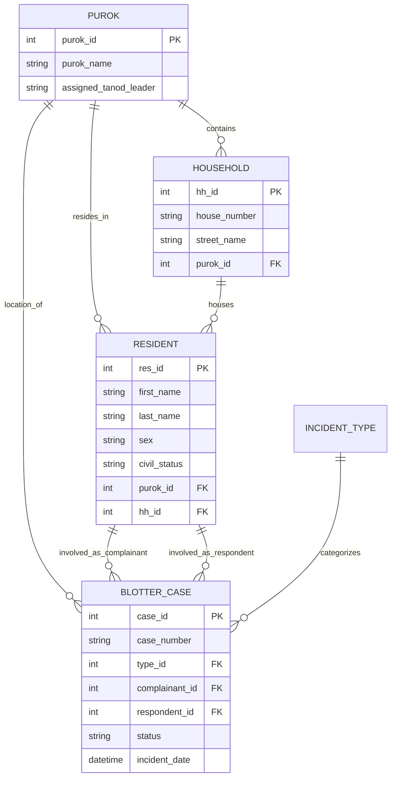

# KALASAG: Barangay Information System with Predictive Crime Analytics
## Technical Documentation & Project Report

### 1. Executive Summary
**KALASAG** is a comprehensive desktop application designed for Barangay record management and crime analytics. It streamlines the management of resident data, household information, and blotter cases (incidents). A key feature is its **Predictive Crime Analytics** module, which visualizes crime hotspots and temporal trends to aid in decision-making and resource allocation (e.g., Tanod patrolling).

### 2. System Architecture

The application follows the **Model-View-Controller (MVC)** architectural pattern to ensure separation of concerns, maintainability, and scalability.

*   **Model**: Handles database interactions, business logic, and data validation. (e.g., `models/resident.py`, `models/blotter.py`)
*   **View**: Manages the User Interface (UI) and presentation logic using `tkinter`. (e.g., `views/resident_view.py`, `views/analytics_view.py`)
*   **Controller**: Acts as an intermediary, processing user input from the View and updating the Model. (e.g., `controllers/resident_controller.py`)

#### 2.1 Technology Stack
*   **Language**: Python 3.x
*   **GUI Framework**: Tkinter (Standard Python GUI)
*   **Database**: SQLite3 (Relational Database)
*   **Data Processing**: Pandas (DataFrames & Analysis)
*   **Analytics/Visualization**: Matplotlib (Embedded in Tkinter)
*   **Reporting**: ReportLab (PDF Generation)
*   **Deployment**: PyInstaller (Executable Packaging)

#### 2.2 Project Structure
```
kalasag/
├── controllers/        # Business logic and event handling
├── models/             # Database schemas and CRUD operations
├── views/              # UI components and screens
├── utils/              # Helper functions (PDF, Validators)
├── database.py         # Database connection and initialization
├── main.py             # Application entry point
├── build_exe.py        # Build script for creating executables
├── config.py           # Configuration settings
└── kalasag.db          # SQLite Database file
```

### 3. Database Schema

The system uses a relational database design to ensure data integrity.

#### 3.1 Entity-Relationship Diagram (Mermaid)



#### 3.2 Key Tables
1.  **`resident`**: Stores individual demographic data.
2.  **`household`**: Groups residents into physical locations.
3.  **`purok`**: Geographical divisions within the Barangay.
4.  **`blotter_case`**: Records of incidents, linked to residents and incident types.
5.  **`user`**: System accounts with role-based access (Captain, Secretary, Admin).

### 4. Core Modules & Methodology

#### 4.1 Resident Management
*   **Functionality**: Add, Edit, View, and Archive residents.
*   **Methodology**: Uses `models.resident.ResidentModel` for CRUD operations. Data is validated using `utils.validators` before insertion.
*   **UI**: `ResidentView` provides a searchable Treeview of residents with filtering capabilities.

#### 4.2 E-Blotter System
*   **Functionality**: Digital recording of complaints and incidents.
*   **Methodology**:
    *   Generates unique Case Numbers automatically.
    *   Links incidents to specific `IncidentTypes` (e.g., Theft, Physical Injury) for categorization.
    *   Tracks case status: *Pending, Scheduled for Mediation, Settled, Filed in Court, Dismissed*.
*   **Recidivism Check**: Automatically checks if a respondent has prior cases.

#### 4.3 Predictive Analytics
*   **Functionality**: Visualizes data to identify trends.
*   **Methodology**:
    1.  **Data Aggregation**: SQL queries group data by `purok`, `incident_type`, or `time_of_day`.
    2.  **Data Processing**: `Pandas` DataFrames are used to structure and manipulate the data for analysis.
    3.  **Visualization**: `Matplotlib` generates charts (Bar charts, Pie charts, Heatmaps).
    4.  **Embedding**: `FigureCanvasTkAgg` embeds these charts directly into the Tkinter `AnalyticsView`.
*   **Key Metrics**:
    *   **Crime Hotspots**: Incidents per Purok.
    *   **Time Analysis**: Peak hours for incidents.
    *   **Demographics**: Population distribution by Age/Sex.

#### 4.4 Document Generation
*   **Functionality**: Issues certificates (Barangay Clearance, Indigency, etc.).
*   **Methodology**:
    *   Uses `ReportLab` to draw text and graphics on a PDF canvas.
    *   Templates are defined in `utils.pdf_generator`.
    *   Dynamic data (Resident Name, Date, Captain's Name) is injected into the template at runtime.

### 5. User Roles & Security

| Role | Permissions |
| :--- | :--- |
| **Admin** | Full system access, User management, Database backup. |
| **Captain** | View Analytics, Sign Documents, View Sensitive Cases. |
| **Secretary** | Manage Residents, Manage Blotter, Generate Documents. |
| **Tanod** | View Blotter (Read-only), View Patrol Recommendations. |

### 6. Deployment & Distribution

The application is packaged as a standalone Windows executable (`.exe`) using **PyInstaller**.

*   **Build Script**: `build_exe.py` automates the build process.
*   **Configuration**: `config.py` detects if the app is running as a script or frozen exe to set correct file paths.
*   **Output**: The executable is generated in the `dist/` folder.
*   **Data Persistence**: The database (`kalasag.db`) is stored in the same directory as the executable to ensure portability.

### 7. References

*   **Python Documentation**: https://docs.python.org/3/
*   **Tkinter**: https://docs.python.org/3/library/tkinter.html
*   **Pandas**: https://pandas.pydata.org/
*   **Matplotlib**: https://matplotlib.org/
*   **ReportLab**: https://www.reportlab.com/
*   **SQLite**: https://www.sqlite.org/index.html
